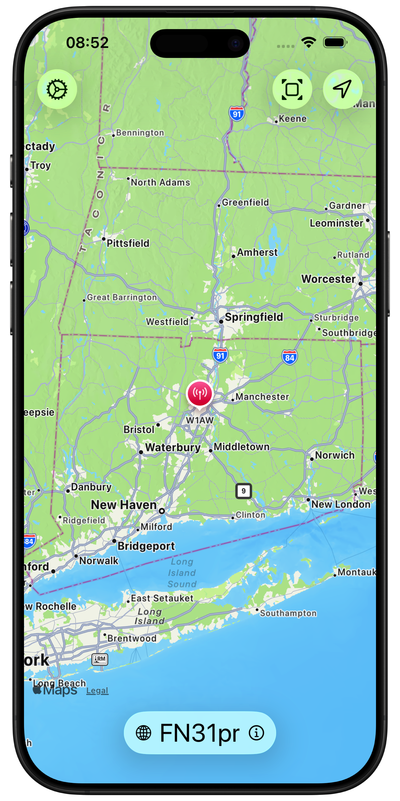
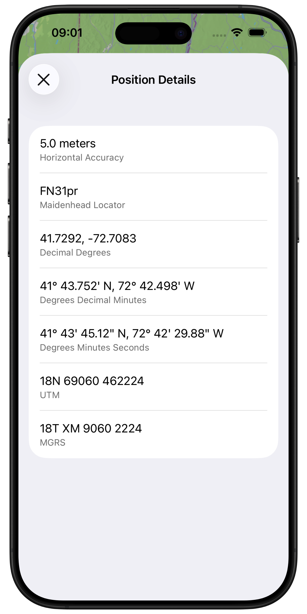

# MyQTH

MyQTH is a native iOS location utility for amateur radio operators that displays the user’s current position in several geographic coordinate systems.

Built with SwiftUI, MapKit, and Core Location, MyQTH presents the current location on an interactive map while providing quick access to Maidenhead, latitude/longitude, UTM/UPS, and MGRS coordinates.

## Screenshots

<p align="center">
  
  &nbsp;
  
</p>

## Features

- Display the current position on an interactive MapKit map
- Show the current **Maidenhead grid locator**
- Display latitude and longitude as:
  - Decimal Degrees (DD)
  - Degrees Decimal Minutes (DDM)
  - Degrees Minutes Seconds (DMS)
- Convert coordinates to:
  - Universal Transverse Mercator (UTM)
  - Universal Polar Stereographic (UPS)
  - Military Grid Reference System (MGRS)
- Display Core Location horizontal accuracy
- Select map zoom levels corresponding to Maidenhead:
  - Field
  - Square
  - Subsquare
- Add an amateur radio callsign to the map marker
- Choose between:
  - On-demand location updates
  - Continuous location updates
- Pan and zoom the map independently while continuous updates are enabled
- Copy coordinate values using standard iOS text selection
- Handle Core Location authorization and location errors

## Coordinate Systems

### Maidenhead Locator System

The Maidenhead Locator System is widely used by amateur radio operators to describe geographic locations using a compact grid reference such as:

```text
FN31pr
```

MyQTH supports both four- and six-character Maidenhead locators and uses the six-character subsquare for the primary location display.

### Latitude / Longitude

Coordinates are displayed in three common notations:

```text
41.7292, -72.7083
Decimal Degrees

41° 43.752' N, 72° 42.498' W
Degrees Decimal Minutes

41° 43' 45.12" N, 72° 42' 29.88" W
Degrees Minutes Seconds
```

### UTM and UPS

MyQTH implements WGS 84 Universal Transverse Mercator conversion for locations between 80°S and 84°N, including the special UTM zone rules for Norway and Svalbard.

```text
18N 69060 462224
UTM
```

Locations outside the UTM coverage area are represented using the Universal Polar Stereographic coordinate system.

### MGRS

The app also converts locations to Military Grid Reference System coordinates, including both UTM and polar regions.

```text
18T XM 9060 2224
MGRS
```

## Technology

MyQTH is written entirely in Swift using Apple frameworks:

- Swift
- SwiftUI
- MapKit
- Core Location
- Foundation
- Swift Testing

There are no third-party runtime dependencies.

## Requirements

- iOS / iPadOS 26.5 or later
- Xcode with support for the iOS 26.5 SDK
- A physical iPhone or iPad is recommended for testing live Core Location data

The iOS Simulator can also be used with a simulated location configured through Xcode.

## Building

Clone the repository:

```bash
git clone https://github.com/foxrunlabs/myqth.git
cd myqth
```

Open the Xcode project:

```bash
open MyQTH.xcodeproj
```

Then:

1. Select the **MyQTH** scheme.
2. Select an iPhone or iPad simulator or connected device.
3. Configure code signing if building for a physical device.
4. Build and run the project.

The app requires permission to access the device's location while in use.

## Testing

MyQTH includes unit tests for its coordinate-conversion and formatting code using Apple's Swift Testing framework.

The test suite covers areas including:

- Maidenhead locator validation and normalization
- Maidenhead coordinate conversion and round-trip conversion
- UTM coordinate conversion
- UTM zone selection
- Norway and Svalbard special UTM zones
- UPS polar coordinate conversion
- MGRS conversion
- Invalid coordinate handling
- Coordinate formatting and precision

Run the tests in Xcode with:

```text
Product → Test
```

or press:

```text
⌘U
```

## Design Goals

MyQTH is intended to remain a simple, focused location utility rather than a full mapping or navigation application.

The project emphasizes:

- Native Apple frameworks
- Minimal dependencies
- Clear separation between coordinate mathematics and presentation
- Explicit geographic coordinate types
- Predictable coordinate formatting
- Testable conversion algorithms
- A simple interface suitable for quickly obtaining a location in the field

## Accuracy and Precision

The coordinate formats displayed by MyQTH are derived from the position supplied by Core Location.

Displayed precision should not be interpreted as greater positional accuracy than the underlying location measurement. The Position Details view therefore includes Core Location's reported horizontal accuracy along with the formatted coordinates.

Coordinate conversions use the WGS 84 reference system.

## Privacy

MyQTH uses the device's location to calculate and display coordinates locally.

The application does not require an account or remote service to perform its coordinate conversions.

## Contributing

Issues and pull requests are welcome.

When contributing changes to coordinate-conversion code, please include or update tests for applicable boundary conditions, known reference coordinates, and formatting behavior.

## License

MyQTH is available under the [MIT License](LICENSE).

Copyright © 2026 Ryan Clarke